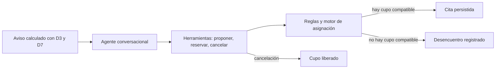

# Cómo funciona AURA

Guía de incorporación para el equipo

## 1. Flujo completo



El **aviso** selecciona a quién mostrar el mensaje; no elige un servicio. El agente recoge motivo y preferencias. Las **herramientas** son funciones JSON que el agente puede llamar. El motor filtra opciones y, al reservar, verifica de nuevo que el cupo siga libre.

## 2. El aviso

Una **señal** es una condición que resume una parte de la trayectoria académica. Cada señal vale uno si se cumple y cero si no; el **puntaje** es la suma, sin ponderaciones distintas. Con la configuración actual, el aviso requiere puntaje mínimo **3** y solo se evalúa durante una semana marcada `evaluation_week` en D7. Los umbrales salen de [parametros.yaml](../config/parametros.yaml); la fecha de evaluación y resultados están en [validacion_aviso.md](../salidas/validacion_aviso.md).

| Señal | Regla actual | Fuente |
|---|---|---|
| S1: temporada | Hoy cae en una semana `evaluation_week` de D7 (en la plataforma; la validación sobre D3 usa todavía `dropout_alert` medio o alto). | `aviso.evento_evaluacion`, [parametros.yaml](../config/parametros.yaml) |
| S2: asistencia | La tasa de asistencia actual bajó al menos **0,05** frente al período anterior. | `aviso.caida_asistencia`, [parametros.yaml](../config/parametros.yaml) |
| S3: nota | `grade_change` es menor o igual que **−0,5**. | `aviso.cambio_nota`, [parametros.yaml](../config/parametros.yaml) |
| S4: carga | Los créditos están en el cuartil superior del período (percentil **0,75**). | `aviso.percentil_carga_creditos`, [parametros.yaml](../config/parametros.yaml) |

**Ejemplo real de D3.** Para `STU_AE_000008`, entre `PER_2026_1` y `PER_2026_2`, la alerta pasa a `medium`; la asistencia baja de **0,884** a **0,732**; `grade_change` es **0,14**, así que S3 no se cumple; y la carga de **27** créditos alcanza el corte del percentil **27,0**. Puntaje: S1 + S2 + S4 = **3**, por lo que es elegible durante la evaluación de `PER_2026_2`. Los valores académicos salen de `D3_academic_trajectory.csv`; los cortes de [parametros.yaml](../config/parametros.yaml).

La comparación agregada con D1 sirve para validar grupos después de calcular el aviso. D1 no entra en las reglas, no cambia el puntaje y no se entrega al agente: así evitamos usar una encuesta de bienestar personal para decidir a quién contactar. De lo académico, el agente solo puede consultar la **asistencia** de la persona (la señal S2), únicamente cuando ella habla de sus faltas; no ve notas, créditos ni alertas (herramienta `consultar_asistencia`, ver [api_agente.md](api_agente.md)). Con puntaje mínimo **3**, los resultados son:

| Período | Elegibles entre estudiantes D3 | Ansiedad media D1: elegibles | Ansiedad media D1: no elegibles | Fuente |
|---|---:|---:|---:|---|
| PER_2026_2 | **12,91%** | **9,05** | **8,00** | [validacion_aviso.md](../salidas/validacion_aviso.md) |
| PER_2026_3 | **8,12%** | **9,55** | **8,01** | [validacion_aviso.md](../salidas/validacion_aviso.md) |
| PER_2026_4 | **13,49%** | **9,13** | **7,99** | [validacion_aviso.md](../salidas/validacion_aviso.md) |

Las medias se calculan solo para estudiantes que aparecen tanto en D1 como en el período de D3; el archivo de resultados conserva medias y tamaños de grupo agregados, no la ansiedad de cada persona. D7 fija las semanas de evaluación; por ejemplo, la validación usa la fecha de inicio de evaluación que aparece en `D7_calendar.csv`.

## 3. Cómo se fabrican los cupos

D6 describe cada servicio: tipo, distrito, horario semanal, capacidad semanal y canales. El generador recorre el horizonte de **2 semanas**, divide los horarios en sesiones de **60 minutos**, reparte la capacidad semanal entre los bloques y asigna cualquier resto a los primeros bloques. Después marca una ocupación inicial de **10%** y libera el **50%** de los cupos restantes. Estos valores y la fecha base **2026-10-01** salen de [parametros.yaml](../config/parametros.yaml); horarios y capacidades, de `D6_services_map.geojson`.

La agenda del experimento grande estima ocupación por servicio con D2; la agenda viva de las herramientas usa la ocupación inicial configurada. En la comparación con D5, cada conversación consulta una copia lógica nueva de la agenda sin reservas: mide compatibilidad, no capacidad agregada ni competencia entre estudiantes.

## 4. Reglas R1–R6

Una **opción** une un cupo con un canal que el servicio ofrece. El motor solo conserva opciones que pasan todas las reglas. Para entenderlas, usamos como ejemplo el perfil de `CONV_AE_000001` en D5: modalidad evening, sin trabajo, prefiere información escrita; D5 la derivó al servicio `SRV_AE_004`, del distrito `DIST_NEBULA`. La comparación D5 produjo la opción `C0000182|digital`. Las demás filas muestran cupos reales de la agenda reproducible y por qué se descartarían con ese perfil o con la variante indicada.

| Regla | En palabras simples | Ejemplo |
|---|---|---|
| R1: horario | El bloque completo cae dentro de un día y una franja permitidos. | `C0000172`, consejería el viernes de **12:00 a 13:00**, queda fuera de la franja evening **17:00–21:00**. |
| R2: afinidad | El tipo de servicio tiene afinidad al menos **0,50** con el motivo. | `C0000301`, career guidance para counseling, tiene afinidad **0,30** y se descarta. |
| R3: canal | El canal debe aparecer tanto en D6 como en los canales aceptados por la solicitud. | `C0000053` ofrece phone; el perfil del ejemplo acepta solo digital. |
| R4: distrito | Si el canal es presencial, el servicio debe ser del distrito declarado. | `C0000036` es presencial en `DIST_GAIA`; para el ejemplo en `DIST_NEBULA` no sirve. Si la solicitud no acepta presencial, también se descarta por R3. |
| R5: fecha futura | La cita debe ser posterior a la fecha base. | La agenda parte de **2026-10-01**; no genera cupos para fechas pasadas ni para ese mismo día. |
| R6: disponibilidad | El cupo debe estar liberado y sin reserva viva. | `C0000200` coincide en horario y servicio, pero pertenece a la ocupación inicial y no está libre. |

Los identificadores de cupo son reproducibles con la configuración actual, los horarios y capacidades de D6 y el generador de [agenda.py](../aura/motor/agenda.py). Las condiciones y la afinidad se implementan en [reglas.py](../aura/motor/reglas.py); el perfil y la opción evaluada de D5 están en [comparacion_d5.csv](../salidas/comparacion_d5.csv).

## 5. Costo individual y canal

El **costo individual** sirve para ordenar las opciones de una persona: menor costo significa una opción preferible. La fórmula actual es:

```text
costo = d / P_canal + beta * (1 - afinidad)
```

`d` son los días de espera desde hoy; `P_canal` es la probabilidad de asistencia asociada al canal; `beta` determina cuánto pesa la afinidad. Los valores configurados son **0,725** para digital, **0,707** para phone, **0,667** para in-person y **5,0** para beta. Fuente: [parametros.yaml](../config/parametros.yaml).

`P_canal` depende del canal, no de quién solicita: el prototipo no personaliza la probabilidad con rasgos individuales. La razón es la señal predictiva limitada: el área bajo la curva ROC (**AUC**, que mide si un modelo ordena casos mejor que el azar) de la regresión logística principal es **0,5407**; gradient boosting logra **0,5092** y el baseline suavizado **0,4998**. AUC **0,5** equivale al azar. Hay una variante exploratoria que incorpora D1 con AUC **0,5501**; está marcada como exploratoria y no se usa para filtrar estudiantes. Fuente: [metricas_modelos.csv](../salidas/metricas_modelos.csv). La política de `P_canal` se conserva como tabla compartida para todas las personas, en [parametros.yaml](../config/parametros.yaml).

## 6. Afinidad provisional

La **afinidad** mide cuánto se parece el tipo de servicio a la necesidad traducida desde el motivo. Los valores y el corte están marcados **PROVISIONAL** en [tablas.yaml](../config/tablas.yaml) y [parametros.yaml](../config/parametros.yaml).

| Motivo ideal ↓ / servicio → | Counseling | Peer support | Career guidance | Fuente |
|---|---:|---:|---:|---|
| Counseling | **1,0** | **0,6** | **0,3** | [tablas.yaml](../config/tablas.yaml) |
| Peer support | **0,6** | **1,0** | **0,4** | [tablas.yaml](../config/tablas.yaml) |
| Career guidance | **0,3** | **0,4** | **1,0** | [tablas.yaml](../config/tablas.yaml) |

Con el umbral actual de **0,50**, counseling puede aceptar peer support como alternativa; career guidance no pasa ese corte para counseling. El equipo debe revisar afinidades y corte con responsables de servicios antes de tratar estos valores como política definitiva.

## 7. Cómo decide el algoritmo genético

Un **cromosoma** es una lista de estudiantes ordenada por prioridad. En la “fila del buffet”, hay cupos C1 martes noche, C2 miércoles tarde y C3 jueves tarde. Ana solo puede tarde; Beto puede tarde o noche; Caro solo puede noche. Con `[Beto, Ana, Caro]`, Beto toma C1, Ana toma C2 y Caro queda sin cita. Con `[Caro, Beto, Ana]`, Caro toma C1, Beto puede tomar C2 y Ana C3: todos consiguen cita. El orden cambia quién llega primero a una opción compatible.

El **decodificador** recorre ese orden, busca la opción libre de menor costo para cada persona y crea el diccionario `asignacion`; si no hay ninguna, registra un desencuentro. El **fitness** (puntuación de calidad que el algoritmo intenta minimizar) combina cinco objetivos:

| Término | Fórmula en palabras | Qué mide | Peso actual |
|---|---|---|---:|
| Z1 | Número de solicitudes sin cita. | Cobertura perdida. | **0,35** |
| Z2 | Suma de `d / P_canal` de las citas. | Espera ajustada por asistencia del canal. | **0,25** |
| Z3 | Varianza de la utilización de los servicios; utilización = asignados / cupos liberados. | Desbalance de carga entre servicios. | **0,10** |
| Z4 | Máximo entre la espera media diurna y la nocturna. | Evita que un grupo cargue con la peor espera media. | **0,20** |
| Z5 | Suma de `1 − afinidad` de las citas. | Pérdida de ajuste entre necesidad y servicio. | **0,10** |

Los pesos salen de [parametros.yaml](../config/parametros.yaml). Antes de sumarlos, cada Z se normaliza con la **tabla de pagos**: los mínimos (`Zmin`) y máximos (`Zmax`) se obtienen de cinco corridas que optimizan cada término por separado. Para un término con rango, se usa `(Z − Zmin) / (Zmax − Zmin)`; si no hay rango, se usa cero. El objetivo total es la suma de cada Z normalizado por su peso. Fuente del método y corridas: [reporte.md](../salidas/reporte.md), [metadatos.json](../salidas/metadatos.json).

El algoritmo crea y mejora muchos órdenes candidatos. Cada mecanismo hace una tarea distinta:

- **Cruce OX:** conserva un tramo del orden de un padre y completa los lugares restantes siguiendo el otro padre; así mantiene a cada estudiante una sola vez.
- **Mutación por intercambio:** cambia de lugar dos estudiantes para explorar otra prioridad posible.
- **Torneo:** escoge varios candidatos al azar y deja que compita el de menor costo.
- **Elitismo:** conserva los mejores candidatos de la generación y evita perder una solución que ya era buena.

La población es de **50** órdenes y se comparan **5** semillas (**42–46**). x1, x2 y x4.3 estándar ejecutan **200** generaciones; x6, x8 y x4.3 con liberación reducida ejecutan **500**. Fuente: [parametros.yaml](../config/parametros.yaml).

## 8. Modo directo y modo lote

El **modo directo** atiende una conversación: propone opciones y reserva cuando la persona acepta. El **modo lote** reparte los cupos de los servicios muy ocupados entre varias solicitudes a la vez, con el algoritmo genético de la sección 7. Los dos funcionan en la plataforma.

**Cuándo se activa.** Cada servicio tiene una **utilización**: cupos reservados ÷ cupos liberados de la agenda abierta (la misma «ocupación» del panel). Cuando llega al **75 %** (`modo_lote_umbral_utilizacion`, acordado por el equipo; antes 70 % provisional), el servicio entra en **modo lote**: sus cupos dejan de ofrecerse uno a uno. Si baja del umbral (por una cancelación), vuelve al modo directo.

**Qué le pasa a una solicitud.**

1. `proponer_opciones` busca solo entre servicios en modo directo. Si hay opciones, todo sigue como siempre.
2. Si lo único compatible está en modo lote, no hay opciones para elegir: se ofrece **entrar al lote** (el agente lo explica y la persona debe aceptar).
3. La solicitud espera en el **lote abierto**. El primero que entra abre la cuenta regresiva.

**Cuándo se cierra: solo.** A los `lote.ventana_segundos` (30 s) de entrar la primera solicitud, o apenas junta `lote.tamano_maximo` (5), lo que ocurra primero. Nadie lo cierra a mano.

**Cómo se resuelve.** Al cerrarse, el genético decide un orden de prioridad para todo el grupo y el decodificador asigna a cada persona la opción libre de menor costo (mismas reglas R1–R6, mismo costo individual y mismo fitness Z1–Z5 que en la sección 7). Después la plataforma reserva las citas, registra como desencuentro a quien no encontró cupo y avisa a cada estudiante en vivo. Dos simplificaciones, por correr en vivo: la normalización de Z usa los límites fijos del «plan B» del experimento (no las cinco calibraciones por lote), y la utilización de Z3 usa como denominador los cupos que aún quedan libres. Si el genético no mejora el orden de llegada, se conserva el de llegada. Con 1 solicitud no hay nada que optimizar.

**Qué esperar.** Como dice la sección 9, el genético no crea capacidad: cuando las solicitudes de un lote no compiten por los mismos cupos, el resultado es igual al de asignar por orden de llegada. Cambia el orden cuando eso reparte mejor (más asignadas, menos espera, más equidad entre diurnos y nocturnos).

Todo vive en RAM y se vacía al reiniciar el backend o la demo. Código: [lote_service.py](../app/services/lote_service.py) (reglas, temporizador, aplicar reservas) y [lote.py](../aura/herramientas/lote.py) (planificación con el genético). Parámetros: `modo_lote_umbral_utilizacion` y el bloque `lote` de [parametros.yaml](../config/parametros.yaml).

## 9. Resultados del experimento y lectura honesta

La tabla muestra el porcentaje medio asignado de Llegada y Genético, más las esperas del Genético. `±` es la desviación estándar entre las **5** semillas. Los datos vienen de [resumen_5_semillas.csv](../salidas/resumen_5_semillas.csv); generaciones y tiempos, de [reporte.md](../salidas/reporte.md) y [metadatos.json](../salidas/metadatos.json).

| Escenario | Asignados: llegada | Asignados: genético | Espera media GA (días) | Diurnos GA | Nocturnos GA | Desencuentros GA |
|---|---:|---:|---:|---:|---:|---:|
| x1 | 100,00% ± 0,00 pp | 100,00% ± 0,00 pp | 1,91 ± 0,08 | 1,90 ± 0,07 | 1,90 ± 0,19 | 0,00 ± 0,00 |
| x2 | 100,00% ± 0,00 pp | 100,00% ± 0,00 pp | 3,22 ± 0,07 | 3,22 ± 0,06 | 3,24 ± 0,09 | 0,00 ± 0,00 |
| x4.3 | 99,88% ± 0,17 pp | 99,96% ± 0,09 pp | 5,93 ± 0,05 | 5,93 ± 0,05 | 5,93 ± 0,06 | 0,20 ± 0,45 |
| x6 | 87,94% ± 0,69 pp | 87,67% ± 0,41 pp | 6,91 ± 0,07 | 6,91 ± 0,07 | 6,90 ± 0,09 | 88,80 ± 2,95 |
| x8 | 69,81% ± 0,44 pp | 69,90% ± 0,48 pp | 6,91 ± 0,07 | 6,91 ± 0,07 | 6,91 ± 0,07 | 289,00 ± 4,58 |
| x4.3, 25% liberado | 65,89% ± 0,49 pp | 65,89% ± 0,49 pp | 6,94 ± 0,17 | 6,94 ± 0,17 | 6,94 ± 0,19 | 176,00 ± 2,55 |

El genético **no crea capacidad**: cuando la demanda supera los cupos disponibles, siguen existiendo desencuentros. En estas corridas, su aporte más claro es acercar las esperas medias de estudiantes diurnos y nocturnos; con escasez, la asignación total queda parecida a Llegada y en x6 incluso algo menor. Por eso el resultado apoya equidad de espera, no una promesa de más citas. El costo de cada escenario se detalla en [reporte.md](../salidas/reporte.md).

## 10. Supuestos editables

| Supuesto | Valor actual | Archivo donde cambiarlo |
|---|---|---|
| Data Pack externo | Carpeta `data_pack/` (D1, D2, D6, D7); `AURA_DATA_DIR` la sobrescribe con el Data Pack completo | [parametros.yaml](../config/parametros.yaml), `data_pack_path` |
| Fecha base / horizonte | 2026-10-01 / 2 semanas | [parametros.yaml](../config/parametros.yaml), `hoy`, `horizonte_semanas` |
| Sesión / cupos liberados / ocupación inicial | 60 min / 0,50 / 0,10 | [parametros.yaml](../config/parametros.yaml) |
| Espera, canal y afinidad | beta 5,0; P digital 0,725, phone 0,707, presencial 0,667; corte 0,50 | [parametros.yaml](../config/parametros.yaml) |
| Motivo → servicio y afinidades | Tablas completas en YAML; valores provisionales | [tablas.yaml](../config/tablas.yaml) |
| Pesos multiobjetivo | Z1 0,35; Z2 0,25; Z3 0,10; Z4 0,20; Z5 0,10 | [parametros.yaml](../config/parametros.yaml), `pesos_z` |
| Umbrales del aviso | Caída de asistencia 0,05; caída de nota −0,5; percentil 0,75; puntaje mínimo 3 | [parametros.yaml](../config/parametros.yaml), `aviso` |
| Corridas del experimento | población 50; semillas 42–46; escenarios y generaciones en YAML | [parametros.yaml](../config/parametros.yaml), `experimento` |

## 11. Glosario

| Término | Significado simple |
|---|---|
| AUC | Medida de cuánto mejor que el azar ordena casos un predictor; 0,5 representa azar. |
| Afinidad | Ajuste entre el motivo y el tipo de servicio. |
| Cupo | Bloque de cita con servicio, fecha, hora y canales posibles. |
| Desencuentro | Solicitud que no obtuvo una opción compatible. |
| Decodificador | Parte que convierte un orden de prioridad en citas concretas. |
| Fitness | Valor total que el genético intenta minimizar para comparar asignaciones. |
| Genético | Búsqueda que mejora órdenes candidatos mediante cruce, mutación y selección. |
| Normalización | Conversión de objetivos con escalas distintas a rangos comparables. |
| Tabla de pagos | Resultados de las optimizaciones individuales que fijan mínimos y máximos de cada Z. |
| Utilización | Proporción de cupos liberados que se asignaron en un servicio. |
